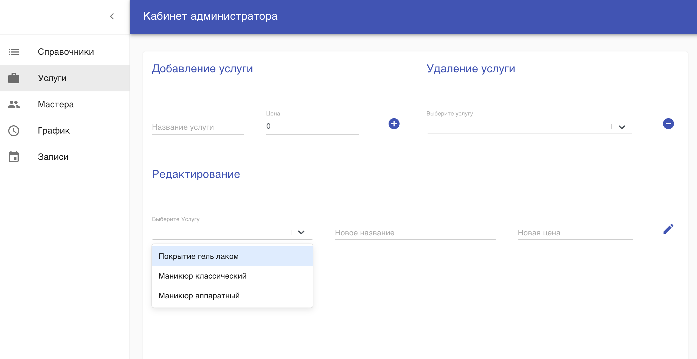
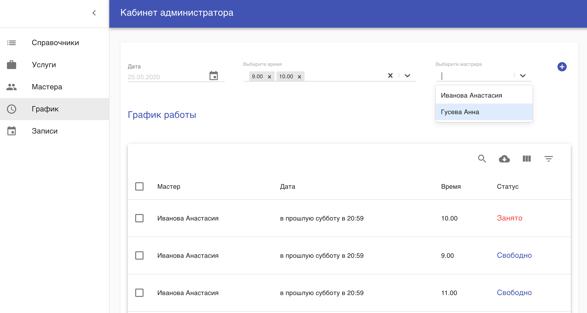
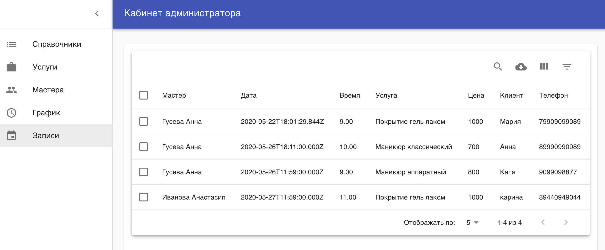

## Данное приложение является панелью администратора

Функционал включает
  
  - Добавление словаря и наполнение например
  > словарь = время  key = time
  #
  - Добавление, редактирование и удаление услуг и мастеров
 
  
  #

  - Работа с графиком мастеров
  
  #

  - Работа с записями
  
  #

  Пример интерфейса для создания записи [https://github.com/espritolka/service-main-app]

  API приложения [https://github.com/espritolka/service-api-app]

  Технологии: ReactJS, MaterialUI, react-select, react-router, axios